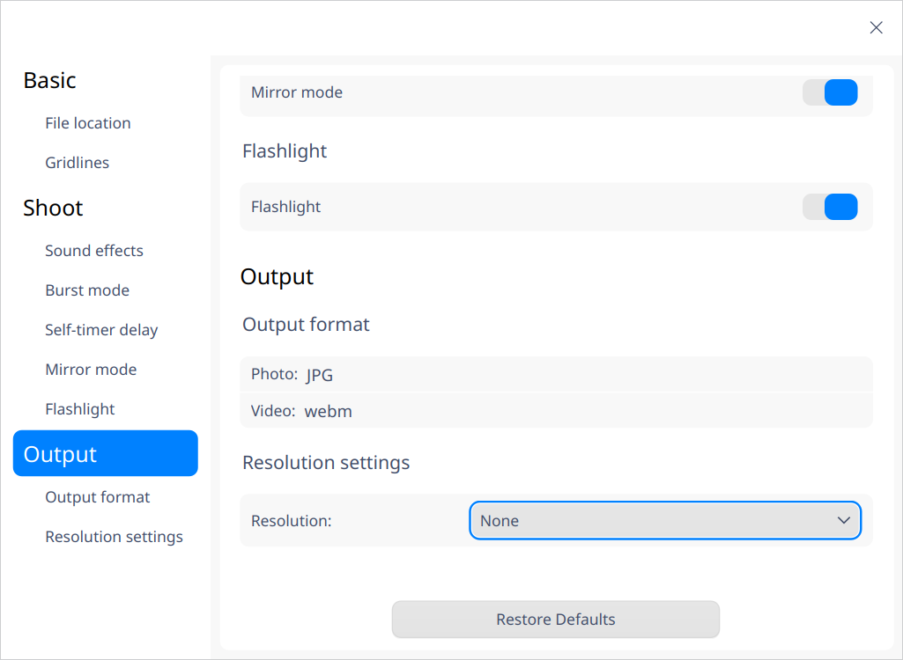

# Camera|deepin-camera|

## Overview

Camera is an easy-to-use camera application that supports multiple functions such as taking photos, recording videos, and switching between multiple camera devices.

## Guide

You can run, close or create shortcuts for Camera in the following ways.

### Run Camera

1. Click  in the Dock and enter the Launcher interface.
2. Locate  by scrolling the mouse wheel or searching "camera" in the Launcher interface and click it to run.
3. Right-click  and you can:

 - Click **Send to desktop** to create a desktop shortcut.
 - Click **Send to dock** to fix the application in the dock.
 - Click **Add to startup** to add the application to startup and it will automatically run when the system starts up.

### Exit Camera

- On the Camera interface, clickto exit Camera.
- Right-click  in the dock and select **Close All** to exit Camera.
- On the Camera interface, click  and select **Exit** to exit Camera.

## Operations

You can use the Camera application if your computer comes with a camera or is connected to a camera.  If there are multiple cameras connected, you can select the camera expected. Select the photo or video mode on the Camera interface to take photos and record videos.

### Take Photos

Photo mode is defaulted when Camera starts up. Click the  icon to take photos, and the photos will be displayed on the interface.

### Record Videos

On the Camera interface, click the  icon to to enter the video mode. Click  the icon to start recording, and click the  icon to stop recording after video recording is completed. Video files will be displayed on the interface, and will also be saved in the default path.

### Process Photos and Videos

On the Camera interface, right-click the photos or video files to select copy, delete, print and open folder.

- Copy: Copy the selected photo/video to another path.

- Delete: Delete the selected photo/video.

- Print: Print the selected photo. Click **Print** and you will be direct to the print preview interface. Set the relevant printing parameters and click the **Save** icon to finish printing.

   Notes: The printing function is only available for photo files. If a video file is contained in the multiple files selected, the **Print** icon will not be displayed.

- Open folder: Open the folder where photos and videos are located.

## Main Menu

On the main menu, you can change settings for Camera, switch window themes, view help manual, and get more information about Camera.

### Settings

1. On the Camera interface, click .
2. Click **Settings** to adjust **Basic**, **Shoot** and **Output** settings.

   - **Basic** setting: set up the **File location** for photos and videos.
   - **Shoot** setting: set up the **Sound effects**, **Burst mode** and **Self-timer delay** options.

     

   - **Output** setting: set up the **Output format** and **Resolution settings** for photos and videos.
   
     

#### Theme

The window theme provides three theme types, namely Light Theme, Dark Theme, and System Theme.

1.  On the Camera interface, click .
2.  Click **Theme** to select a theme.

### Help

1.  On the Camera interface, click .
2.  Click **Help** to view the manual of Camera.

### About

1.  On the Camera interface, click .
2.  Click **About** to view the version and introduction of Camera. 

### Exit

1.   On the Camera interface, click . 
2.  Click **Exit** to exit Camera.