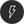

# Camera | deepin-camera

## Overview

Camera is a simple and easy-to-use camera application that enables photo capture, video recording, and supports multiple camera switching.

## Getting Started

You can run or close the Camera, or create shortcuts through the following methods.

### Running Camera

1. Click the Launcher icon  on the taskbar to enter the Launcher interface.
2. Scroll the mouse wheel or search to locate the Camera icon , then click to run.
3. Right-click  to:
   - Click **Send to Desktop** to create a desktop shortcut.
   - Click **Pin to Taskbar** to pin the application to the taskbar.
   - Click **Start on Boot** to add the application to startup items, automatically running when the computer starts.

### Closing Camera

- Click  in the Camera interface to exit.
- Right-click  on the taskbar and select **Close All** to exit Camera.
- Click  in the Camera interface and select **Exit** to exit Camera.

## Icon Introduction

<table class="block1">
    <tbody>
        <tr>
            <td></td>
            <td>Take Photo</td>
            <td></td>
            <td>Video</td>
            <td></td>
            <td>Switch Camera</td>
        </tr>
        <tr>
            <td></td>
            <td>Expand Toolbar</td>
            <td></td>
            <td>Collapse Toolbar</td>
            <td></td>
            <td>Timer Shooting</td>
       </tr>   
       <tr>
            <td></td>
            <td>Turn On Flash</td>
            <td></td>
            <td>Set Filter</td>
            <td></td>
            <td>Adjust Exposure</td>
        </tr>
    </tbody>
</table>

>  Note: The camera switch button  will only appear when multiple cameras are connected.

## Operations Guide

Using Camera requires a built-in or external camera. After opening Camera, click **Take Photo** or **Video** to switch modes. You can also enable mirror camera in **Settings > Photo Settings** to flip the image horizontally.

>  Note: Supported features may vary depending on decoding technology; refer to the actual interface.

### Taking Photos

After opening Camera, it defaults to photo mode. Click the photo button , and the captured image will be displayed in the interface.

### Recording Video

In the Camera main interface, click **Video** to enter video mode. Click the record button  to start recording. After recording, click the stop button . The video file will be displayed in the interface and saved to the default path.

### Managing Photos/Videos

In the Camera main interface, right-click on a photo/video file to choose copy, delete, print, or open folder.

- Copy: Copy selected photo/video to another path.
- Delete: Delete selected photo/video.
- Print: Print selected photo. Click **Print** to jump to the print preview interface where you can adjust settings before printing.

   > Note: Only photo files support printing; video files won't show the print button.

- Open Folder: Open the folder containing the photo/video.

## Main Menu

In the main menu, you can configure camera settings, switch window themes, view help manuals, etc.

### Settings

1. In the Camera interface, click .
2. Click **Settings** to configure basic settings, photo settings, and output settings.

   - Basic Settings: Set default storage path for photos/videos, choose grid composition style.
   - Photo Settings: Configure sound effects, burst count, timer delay; enable/disable mirror camera and flash.
   - Output Settings: Display image output format; set video output format; configure photo/video resolution.

### Theme

Window themes include Light, Dark, and System.
1. In the Camera interface, click .
2. Click **Theme** and select a theme color.

### Help

1. In the Camera interface, click .
2. Click **Help** to view the help manual and learn more about using Camera.

### About

1. In the Camera interface, click .
2. Click **About** to view the version and introduction of Camera.

### Exit

1. In the Camera interface, click .
2. Click **Exit**.