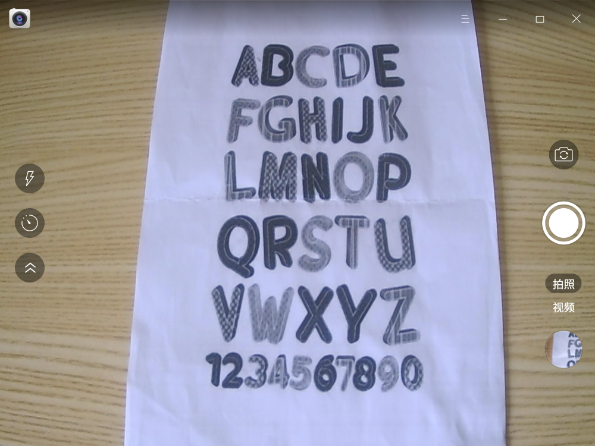
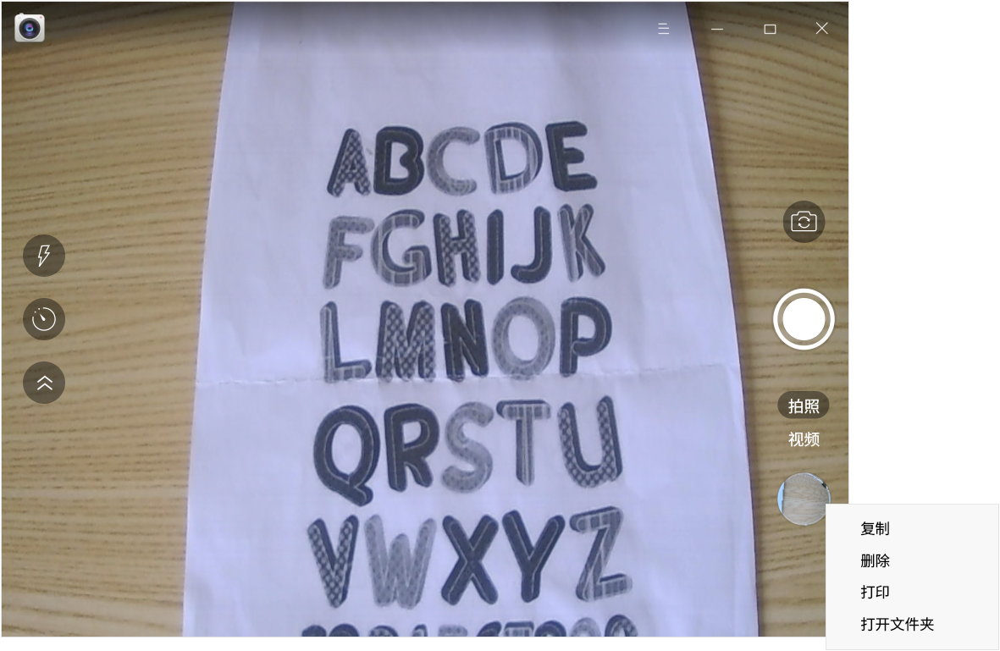
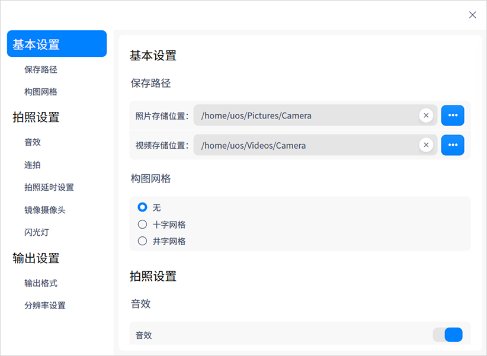
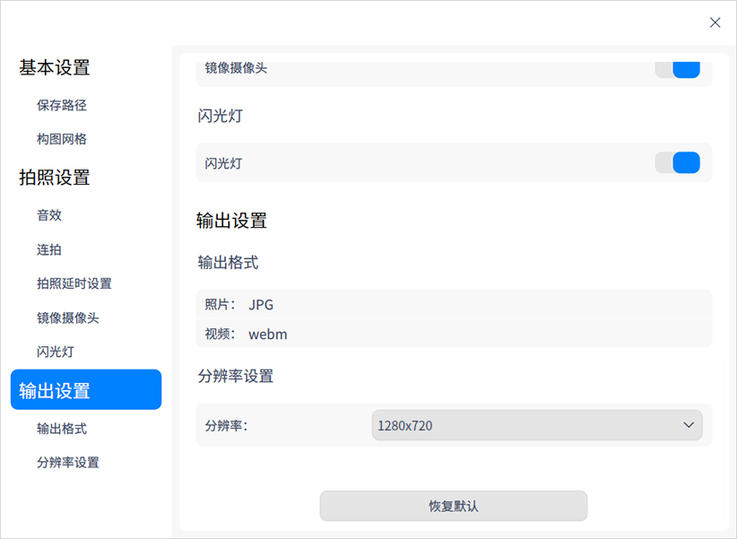

# 相机|deepin-camera|

## 概述

相机是一款简单易用的摄像头应用工具，可实现拍照、录制视频等功能，支持多摄像头切换。

## 使用入门

您可以通过以下方式运行或关闭相机，或者创建快捷方式。

### 运行相机

1. 单击任务栏上的启动器图标 ，进入启动器界面。
2. 上下滚动鼠标滚轮浏览或通过搜索，找到相机图标 ，单击运行 。
3. 右键单击 ，您可以：
   - 单击 **发送到桌面**，在桌面创建快捷方式。
   - 单击 **发送到任务栏**，将应用程序固定到任务栏。
   - 单击 **开机自动启动**，将应用程序添加到开机启动项，在电脑开机时自动运行该应用程序。

### 关闭相机

- 在相机界面单击 ，退出相机。
- 右键单击任务栏上的 ，选择 **关闭所有** 来退出相机。
- 在相机界面单击 ，选择 **退出** 来退出相机。

## 图标介绍

<table class="block1">
    <tbody>
        <tr>
            <td></td>
            <td>拍照</td>
            <td></td>
            <td>视频</td>
            <td></td>
            <td>切换摄像头</td>
        </tr>
        <tr>
            <td></td>
            <td>展开工具栏</td>
            <td></td>
            <td>折叠工具栏</td>
            <td></td>
            <td>延时拍摄</td>
       </tr>   
       <tr>
            <td></td>
            <td>闪光灯</td>
            <td></td>
            <td></td>
            <td></td>
            <td></td>
        </tr>
    </tbody>
</table>

> 说明：当连接多个摄像头时，界面上才会显示切换摄像头按钮 。

## 操作介绍

使用相机的前提是电脑自带摄像头或外接摄像头。打开相机后，单击 **拍照** 或 **视频** 切换模式，您还可以在 **设置 > 拍照设置** 中开启镜像摄像头功能，将画面左右翻转。

### 拍照

打开相机后，默认进入拍照模式。单击拍照按钮 ，拍摄的图片文件会展示在界面。

### 录制视频 

在相机主界面，单击 **视频**，进入视频模式。单击录制视频按钮  进行录制，录制完成后单击结束录制按钮 ，视频文件会展示在界面，也会保存在默认路径下。

### 管理图片/视频

在相机主界面，右键单击图片/视频文件，可选择复制、删除、打印或打开文件夹。

> 说明：仅图片文件支持打印功能，视频文件不会显示打印按钮。

复制：将选中的图片/视频复制到其他路径。

删除：将选中的图片/视频删除。

打印：将选中的图片进行打印。单击 **打印** 后，跳转到打印预览界面，您可以进行相关设置后再打印。

打开文件夹：打开图片/视频所在的文件夹。

## 主菜单

在主菜单中，您可以进行相机设置、切换窗口主题，查看帮助手册等。

### 设置

1. 在相机界面，单击 。

2. 单击 **设置**，您可以进行基本设置、拍照设置及输出设置。

   - 基本设置：设置照片及视频的默认保存路径。

   - 拍照设置：设置音效、连拍次数及拍照延时时间，开启或关闭镜像摄像头、闪光灯。

     

   - 输出设置：设置图片/视频的输出格式，还可以设置分辨率。

     

### 主题

窗口主题包含浅色主题、深色主题和系统主题。

1. 在相机界面，单击 。
2. 单击 **主题**，选择一个主题颜色。

### 帮助

1. 在相机界面，单击 。
2. 单击 **帮助**，查看帮助手册，进一步了解和使用相机。

### 关于

1. 在相机界面，单击 。
2. 单击 **关于**，查看相机的版本和介绍。

### 退出

1. 在相机界面，单击 。
2. 单击 **退出**。

