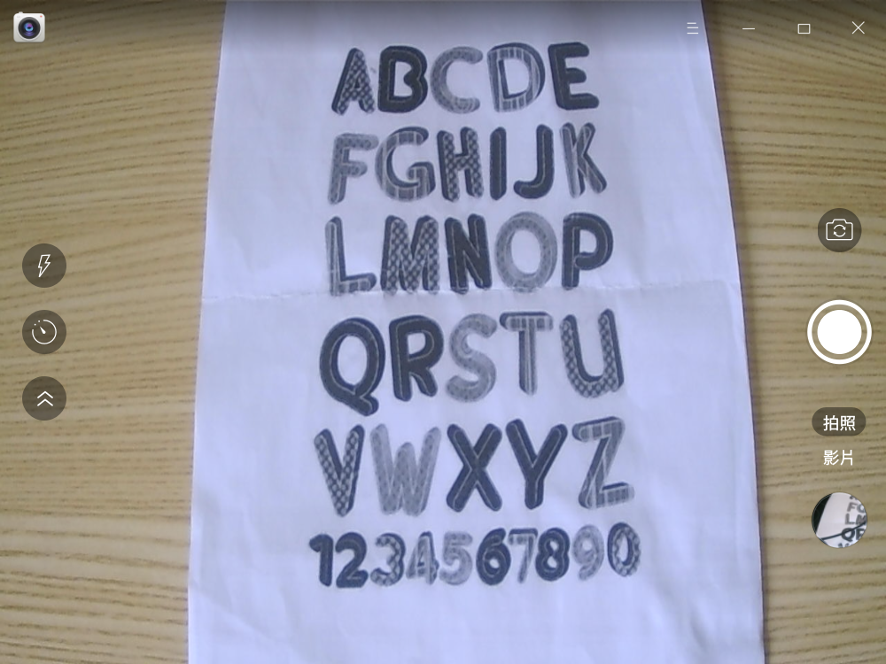
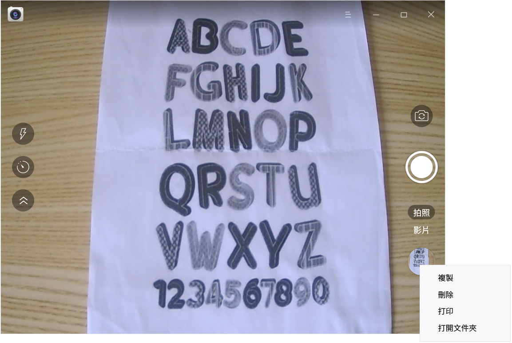
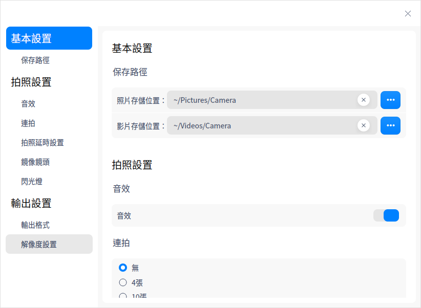
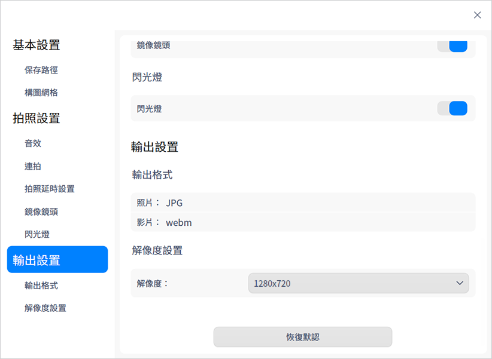

# 相機|deepin-camera|

## 概述

相機是一款簡單易用的鏡頭應用工具，可實現拍照、錄製影片等功能，支持多鏡頭切換。

## 使用入門

您可以通過以下方式運行或關閉相機，或者創建快捷方式。

### 運行相機

1. 單擊任務欄上的啟動器圖標 ，進入啟動器界面。
2. 上下滾動鼠標滾輪瀏覽或通過搜索找到，相機圖標 ，單擊運行。
3. 右鍵單擊 ，您可以：
   - 單擊 **傳送到桌面**，在桌面創建快捷方式。
   - 單擊 **傳送到任務欄**，將應用程序固定到任務欄。
   - 單擊 **加至開機啟動**，將應用程序添加到開機啟動項，在電腦開機時自動運行該應用程序。

### 關閉相機

- 在相機界面單擊 ，退出相機。
- 在任務欄右鍵單擊 ，選擇 **關閉所有** 來退出相機。
- 在相機界面，單擊 ，選擇 **退出** 來退出相機。

## 圖標介紹

<table class="block1">
    <tbody>
        <tr>
            <td></td>
            <td>拍照</td>
            <td></td>
            <td>影片</td>
            <td></td>
            <td>切換鏡頭</td>
        </tr>
        <tr>
            <td></td>
            <td>展開工具欄</td>
            <td></td>
            <td>摺疊工具欄</td>
            <td></td>
            <td>延時拍攝</td>
       </tr>   
       <tr>
            <td></td>
            <td>閃光燈</td>
            <td></td>
            <td></td>
            <td></td>
            <td></td>
        </tr>
    </tbody>
</table>

> 說明：當連接多個鏡頭時，界面上才會顯示切換鏡頭按鈕 。

## 操作介紹

使用相機的前提是電腦自帶鏡頭或外接鏡頭。打開相機後，單擊 **拍照** 或 **影片** 切換模式，您還可以在 **設置 > 拍照設置** 中開啟鏡像鏡頭功能，將畫面左右翻轉。

### 拍照

打開相機後，默認進入拍照模式。單擊拍照按鈕 ，拍攝的圖片文件會展示在界面。

### 錄製影片 

在相機主界面，單擊 **影片**，進入影片模式。單擊錄製影片按鈕  進行錄製，錄製完成後單擊結束錄製按鈕 ，影片文件會展示在界面，也會保存在默認路徑下。

### 管理圖片/影片

在相機主界面，右鍵單擊照片或影片文件，可選擇複製、刪除或打開文件夾。

> 說明：僅圖片文件支持打印功能，影片文件不會顯示打印按鈕。

- 複製：將選中的照片複製到其他路徑。
- 刪除：將選中的照片刪除。
- 打印：將選中的圖片進行打印。單擊 **打印** 後，跳轉到打印預覽界面，您可以進行相關設置後再打印。
- 打開文件夾：打開照片或影片所在的文件夾。

## 主菜單

在主菜單中，您可以進行相機設置、切換窗口主題，查看幫助手冊等操作。

### 設置

1. 在相機界面，單擊 。
2. 單擊 **設置**，您可以進行基本設置、拍照設置及輸出設置。

   - 基本設置：設置照片及影片的默認保存路徑。
   - 拍照設置：設置音效、連拍次數及拍照延時時間，開啟或關閉鏡像鏡頭、閃光燈。

   
    &nbsp;&nbsp;&nbsp;&nbsp;&nbsp;&nbsp;&nbsp;&nbsp;&nbsp;&nbsp;&nbsp;&nbsp;&nbsp;
   
   - 輸出設置：設置照片/影片的輸出格式，還可以設置解像度。
   
   

&nbsp;&nbsp;&nbsp;&nbsp;&nbsp;&nbsp;&nbsp;&nbsp;&nbsp;&nbsp;&nbsp;&nbsp;&nbsp;
### 主題

窗口主題包含淺色主題、深色主題和系統主題。

1. 在相機界面，單擊 。
2. 單擊 **主題**，選擇一個主題顏色。

### 幫助

1. 在相機界面，單擊 。
2. 單擊 **幫助**，查看幫助手冊，進一步了解和使用相機。

### 關於

1. 在相機界面，單擊 。
2. 單擊 **關於**，查看相機的版本和介紹。

### 退出

1. 在相機界面，單擊 。
2. 單擊 **退出**。

