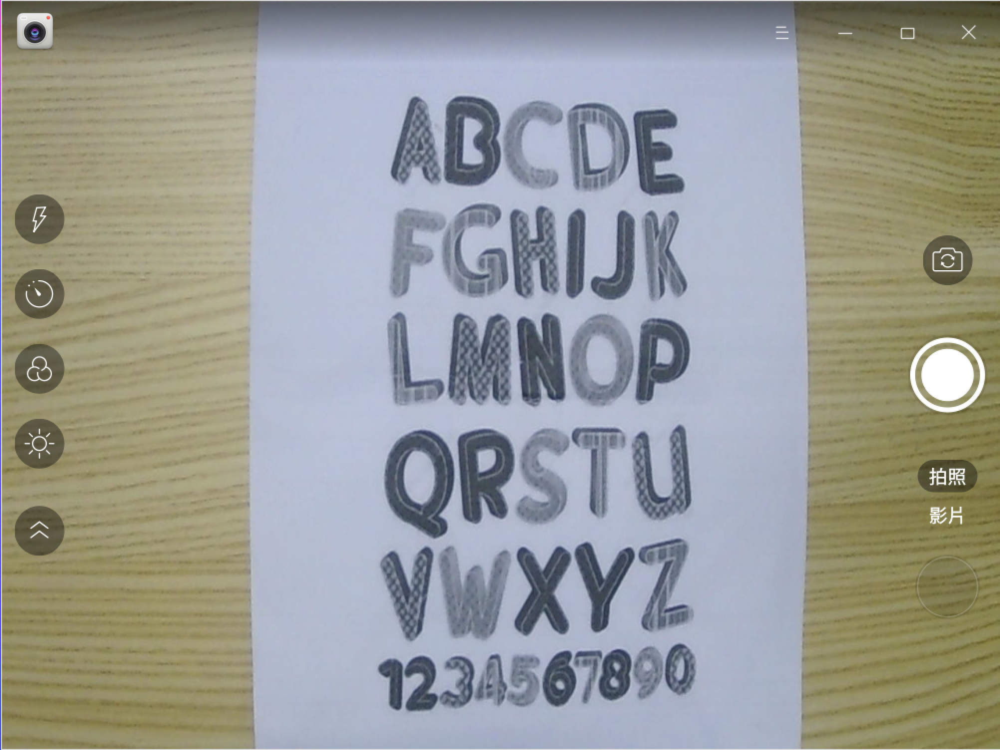
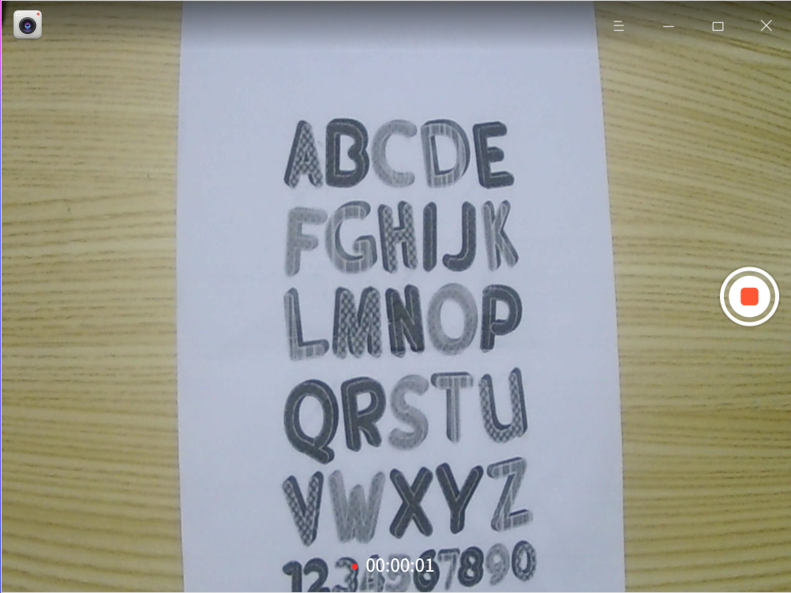
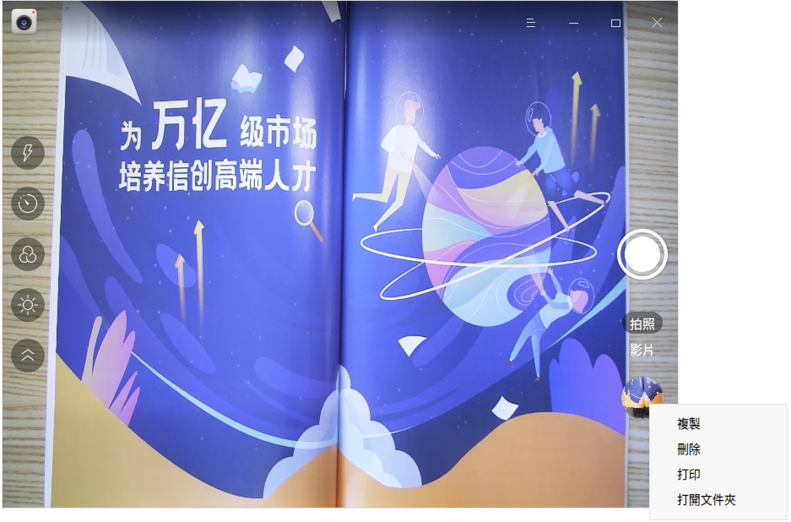

# 相機|deepin-camera|

## 概述

相機是一款簡單易用的攝像頭應用工具，可實現拍照、錄製影片等功能，支援多鏡頭切換。

## 使用入門

您可以透過以下方式執行或關閉相機，或者建立捷徑。

### 執行相機

1. 按一下工作列上的啟動器圖示 ，進入啟動器介面。
2. 滾動滑鼠或搜尋，找到相機圖示 ，按一下執行。
3. 右鍵按一下 ，您可以：
   - 按一下 **傳送到桌面**，在桌面建立捷徑。
   - 按一下 **釘選到工作列**，將應用程式固定到工作列。
   - 按一下 **開機自動啟動**，將應用程式加入到開機啟動項，在電腦開機時自動執行該應用程式。

### 關閉相機

- 在相機介面按一下 ，退出相機。
- 在工作列上右鍵按一下 ，選擇 **全部關閉**，退出相機。
- 在相機介面按一下 ，選擇 **結束**，退出相機。

## 圖示介紹

<table class="block1">
    <tbody>
        <tr>
            <td></td>
            <td>拍照</td>
            <td></td>
            <td>影片</td>
            <td></td>
            <td>切換鏡頭</td>
        </tr>
        <tr>
            <td></td>
            <td>展開工具列</td>
            <td></td>
            <td>摺疊工具列</td>
            <td></td>
            <td>延時拍攝</td>
       </tr>   
       <tr>
            <td></td>
            <td>開啟閃光燈</td>
            <td></td>
            <td>設定濾鏡</td>
            <td></td>
            <td>調節曝光度</td>
        </tr>
    </tbody>
</table>

>  說明：當連接多個鏡頭時，介面上才會顯示切換鏡頭按鈕 。

## 操作介紹

使用相機的前提是電腦內建鏡頭或外接鏡頭。開啟相機後，按一下 **拍照** 或 **影片** 切換模式，您還可以在 **設定 > 拍照設定** 中開啟鏡像鏡頭功能，將畫面左右翻轉。

>  說明：採用不同的解碼技術，其所支援的功能也會不同，請以實際介面為準。

### 拍照

開啟相機後，預設進入拍照模式。按一下拍照按鈕 ，拍攝的圖片檔案會展示在介面。

### 錄製影片

在相機主介面，按一下 **影片**，進入影片模式。按一下錄製影片按鈕  進行錄製，錄製完成後按一下結束錄製按鈕 ，影片檔案會展示在介面，也會儲存在預設路徑下。

### 管理圖片/影片

在相機主介面，右鍵按一下圖片/影片檔案，可選擇複製、刪除、列印或開啟資料夾。

- 複製：將選中的圖片/影片複製到其他路徑。
- 刪除：將選中的圖片/影片刪除。
- 列印：將選中的圖片進行列印。按一下 **列印** 後，跳轉到列印預覽介面，您可以進行相關設定後再列印。

   > 說明：僅圖片檔案支援列印功能，影片檔案不會顯示列印按鈕。

- 開啟資料夾：開啟圖片/影片所在的資料夾。

## 主選單

在主選單中，您可以進行相機設定、切換視窗主題，檢視說明手冊等。

### 設定

1. 在相機介面，按一下 。
2. 按一下 **設定**，您可以進行基本設定、拍照設定及輸出設定。

   - 基本設定：設定相片和影片的預設儲存路徑，選擇構圖網格的樣式。
   - 拍照設定：設定音效、連拍次數及拍照延時時間，開啟或關閉鏡像鏡頭、閃光燈。
   - 輸出設定：顯示圖片的輸出格式，設定影片的輸出格式；設定相片和影片的輸出解析度。

### 主題

視窗主題包含淺色主題、深色主題和系統主題。
1. 在相機介面，按一下 。
2. 按一下 **主題**，選擇一個主題顏色。

### 說明

1. 在相機介面，按一下 。
2. 按一下 **說明**，檢視說明手冊，進一步了解和使用相機。

### 關於

1. 在相機介面，按一下 。
2. 按一下 **關於**，檢視相機的版本和介紹。

### 結束

1. 在相機介面，按一下 。
2. 按一下 **結束**。