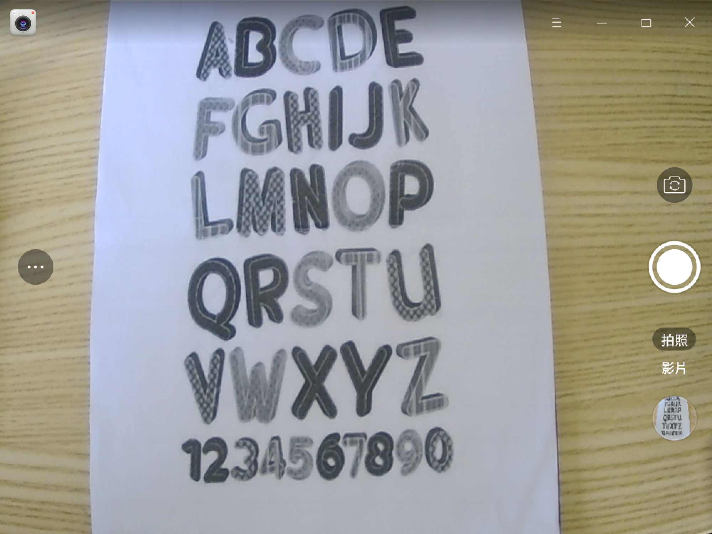
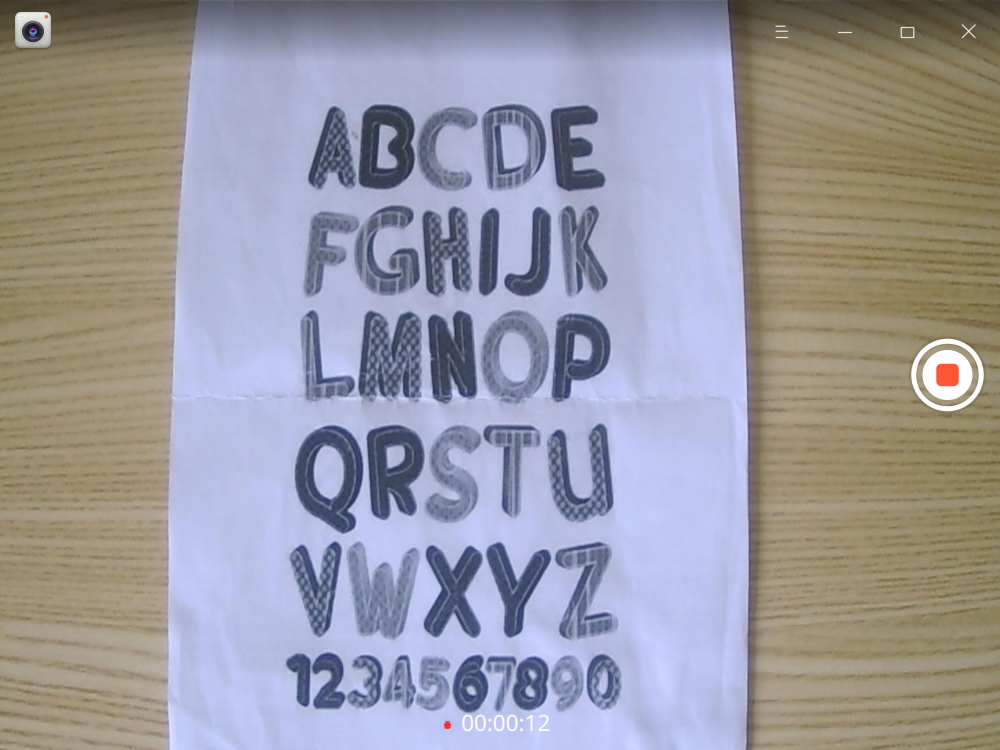
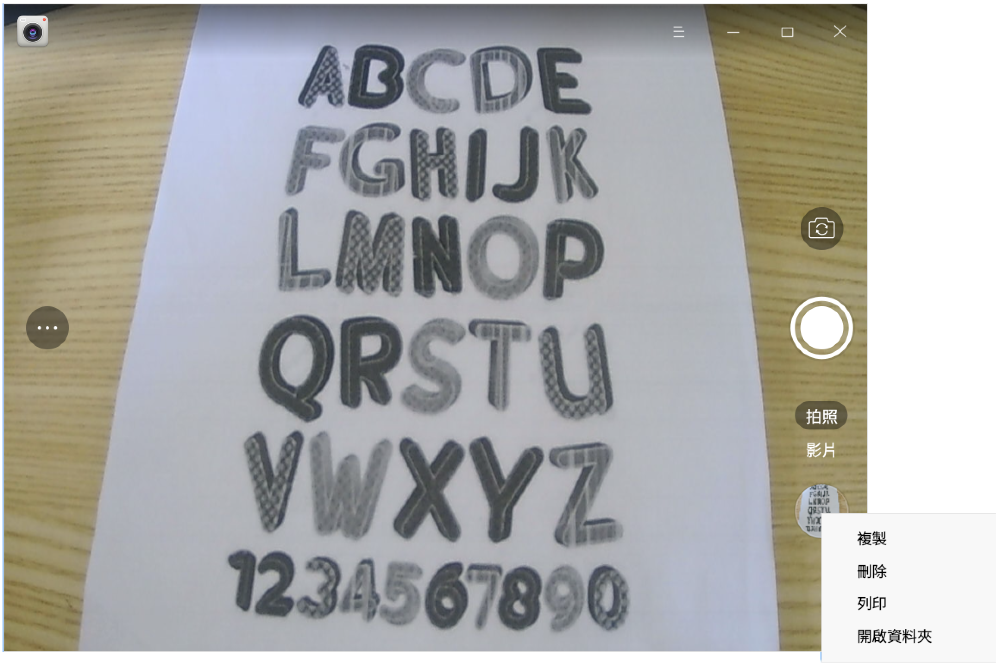
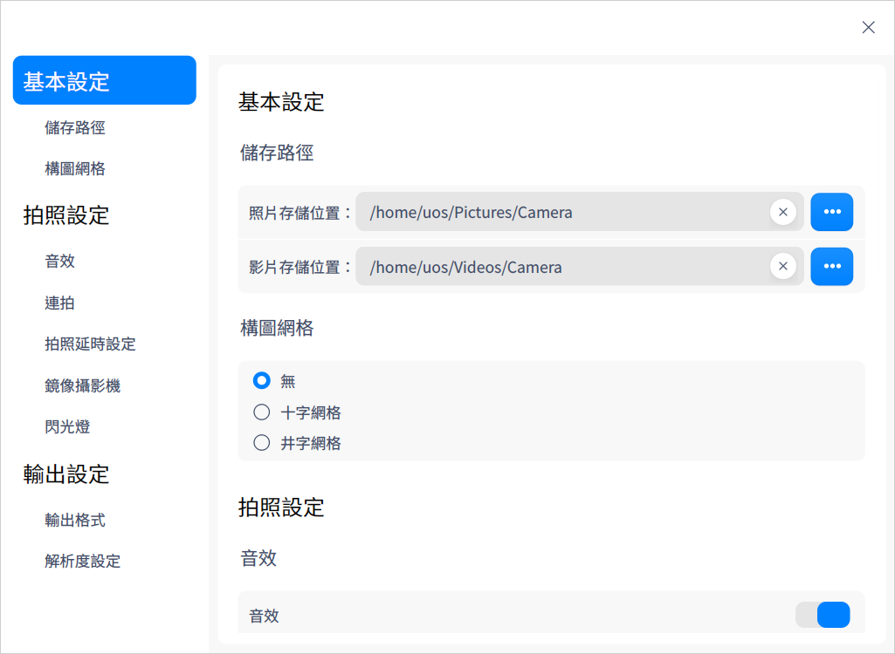
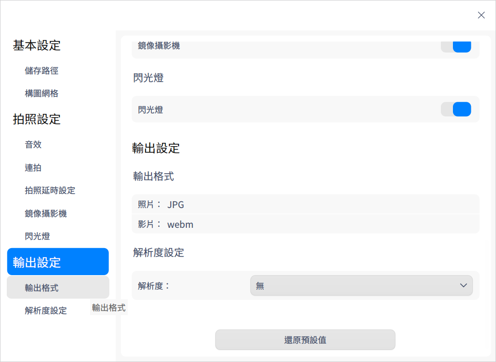

# 相機|deepin-camera|

## 概述

相機是一款簡單易用的攝影機應用工具，可實現拍照、錄製影片等功能，支持多攝影機切換。

## 使用入門

您可以透過以下方式運行或關閉相機，或者創建捷徑。

### 運行相機

1. 單擊任務欄上的啟動器圖示  進入啟動器界面。
2. 上下滾動滑鼠滾輪瀏覽或通過搜索找到「相機」按鈕 ，單擊開啟。
3. 右鍵單擊  ，您可以：
   - 單擊 **建立桌面捷徑**，在桌面創建捷徑。
   - 單擊 **釘選到Dock**，將應用程式固定到Dock。
   - 單擊 **開機啟動**，將應用程式添加到開機啟動項，在電腦開機時自動運行該應用程式。

### 關閉相機

- 在相機界面，單擊 ，關閉相機。
- 右鍵單擊任務欄上的 ，選擇 **全部關閉** 關閉相機。
- 在相機界面單擊 ，選擇 **離開** 關閉相機。

## 圖示介紹

<table class="block1">
    <tbody>
        <tr>
            <td></td>
            <td>拍照</td>
            <td></td>
            <td>影片</td>
            <td></td>
            <td>切換攝影機</td>
        </tr>
        <tr>
            <td></td>
            <td>展開工具列</td>
            <td></td>
            <td>摺疊工具列</td>
            <td></td>
            <td>延時拍攝</td>
       </tr>   
       <tr>
            <td></td>
            <td>閃光燈</td>
            <td></td>
            <td></td>
            <td></td>
            <td></td>
        </tr>
    </tbody>
</table>

>  說明：當連接多個攝影機時，介面上才會顯示切換攝影機按鈕。

## 操作介紹

使用相機的前提是電腦內建攝影機或外接攝影機。打開相機後，單擊 **拍照** 或 **影片** 切換模式，您還可以在 **設定 > 拍照設定** 中開啟鏡像攝影機功能，將畫面左右翻轉。

### 拍照

打開相機後，預設進入拍照模式。單擊拍照按鈕 ，拍攝的圖片文件會展示在介面。

### 錄製影片 

在相機主介面，單擊 **影片**，進入影片模式。單擊錄製影片按鈕  進行錄製，錄製完成後單擊結束錄製按鈕 ，影片檔案會展示在介面，也會儲存在預設路徑下。

### 管理照片/影片

在相機主界面，右鍵單擊照片或影片檔案，可選擇複製、刪除、列印或開啟資料夾。

- 複製：將選中的照片/影片複製到其他路徑。

- 刪除：將選中的照片/影片刪除。

- 列印：將選中的照片進行列印。單擊 **列印** 後，跳轉到列印預覽介面，您可以進行相關設定後再列印。

  > 說明：僅圖片文件支援列印功能，影片文件不會顯示列印按鈕。

- 開啟資料夾：開啟照片或影片所在的資料夾。

## 主選單

在主選單中，您可以進行相機設定、切換窗口主題，查看說明手冊等操作。

### 設定

1. 在相機界面，單擊 。
2. 單擊 **設定**，您可以進行基本設定、拍照設定及輸出設定。
   - 基本設定：設定照片及影片的儲存位置。
   - 拍照設定：設定音效、連拍次數、拍照延時設定、鏡像攝影機、閃光燈。

   

   - 輸出設定：設定照片/影片的輸出格式，還可以設定解析度。

   
   &nbsp;&nbsp;&nbsp;&nbsp;&nbsp;&nbsp;&nbsp;&nbsp;&nbsp;&nbsp;&nbsp;&nbsp;&nbsp; 

### 主題

窗口主題包含亮色主題、暗色主題和系統主題。

1. 在相機界面，單擊 。
2. 單擊 **主題**，選擇一個主題顏色。

### 說明

1. 在相機界面，單擊 。
2. 單擊 **說明**，查看相機的說明手冊，進一步了解和使用相機。

### 關於

1. 在相機界面，單擊 。
2. 單擊 **關於**，查看關於相機的版本和介紹。

### 離開

1. 在相機界面，單擊 。
2. 單擊 **離開**。

